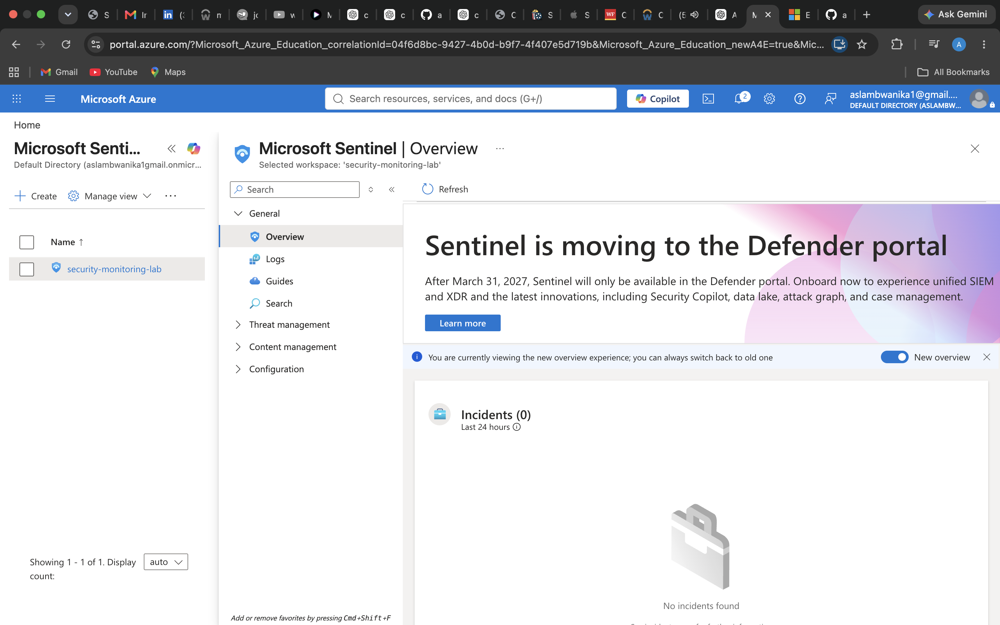
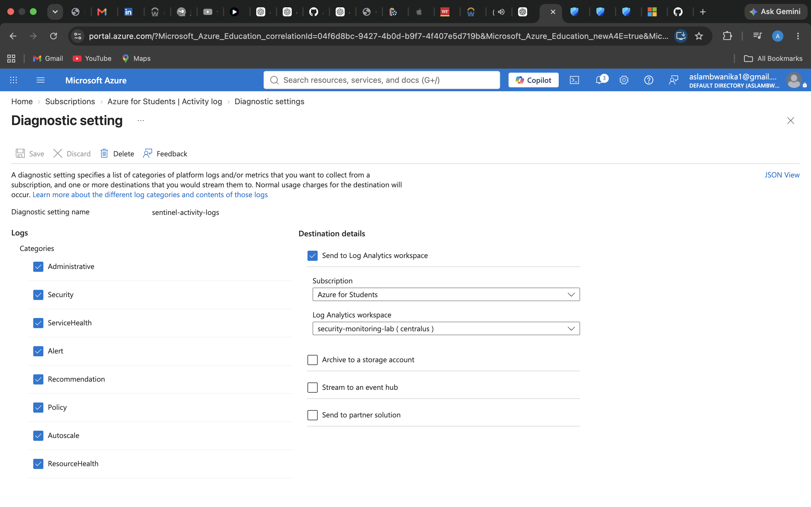
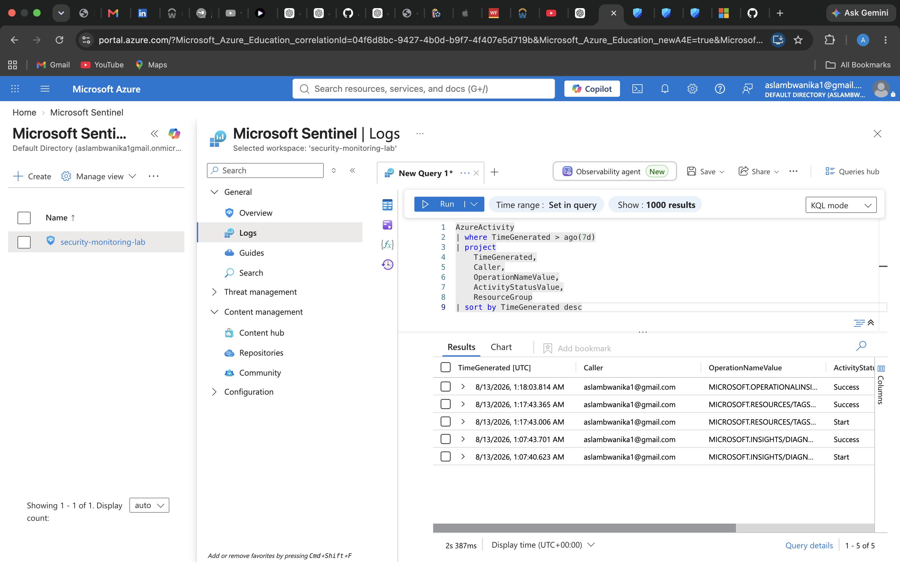
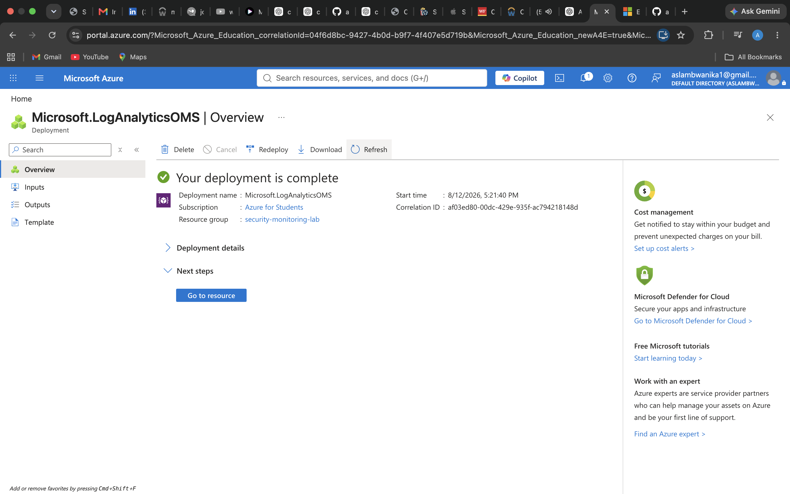

# Azure Cloud Security Monitoring & Detection Platform

A read-only cybersecurity portfolio project that combines Azure Activity monitoring, Microsoft Sentinel/Log Analytics, KQL detection engineering, and a Python/Flask triage dashboard.

## Verified Azure foundation (Phase 1–3)
The project previously configured a Log Analytics workspace in Central US, enabled Microsoft Sentinel, routed Azure Activity Logs to the workspace, and observed results from an `AzureActivity` KQL query with a seven-day time range. Screenshots are retained in [docs/screenshots](docs/screenshots/). Screenshots document those historical milestones, not proof that every proposed rule is deployed.

## Project screenshots (existing Phase 1–3 evidence)

The images below come from the original GitHub commit and show the earlier Azure configuration, log ingestion, KQL investigation, and local Flask proof of concept. They are historical evidence, **not** proof of live deployment of the new dashboard or scheduled Sentinel detection rules. Review and redact any sensitive account or resource details before reusing them in public social posts.

### Microsoft Sentinel enabled


### Azure Activity Logs flowing to Log Analytics


### First successful KQL investigation


### Log Analytics workspace


### Flask backend prototype


[All nine original project screenshots](docs/screenshots/) · [Remaining live-evidence checklist](docs/SCREENSHOT_CHECKLIST.md)

## New code on this branch (Phase 4 onward)
- Four documented, inspectable `AzureActivity` KQL queries, including failed operations and RBAC changes.
- Read-only Python event collector using `DefaultAzureCredential` and Log Analytics query API.
- Deterministic event triage with explainable alert rules.
- Flask dashboard and JSON APIs: `/health`, `/api/summary`, `/api/events`, `/api/alerts`.
- Explicitly labeled synthetic demo data, unit/API tests, and GitHub Actions tests and security scans.

**Limits:** The KQL files have not been automatically deployed as Sentinel analytics rules. No live incidents, Entra sign-in ingestion, autonomous remediation, or production security monitoring are claimed. Live Azure validation requires your tenant credentials/permissions and workspace ID. Existing Mac-local untracked `backend/` and `tests/` were not available through GitHub and have not been incorporated.

## Run locally
Use Python 3.11 or newer:

```bash
python3 -m venv .venv
source .venv/bin/activate
python -m pip install -r requirements.txt
python -m pytest -q
python -m backend.app
```

Open http://127.0.0.1:5001 . By default, the dashboard displays **DEMO DATA** from `examples/sample_azure_activity.json`.

### Optional: live read-only Azure mode
```bash
cp .env.example .env
az login
```
Set `AZURE_LOG_ANALYTICS_WORKSPACE_ID` in `.env` to the Log Analytics *workspace GUID*, and set `APP_MODE=live`. The authenticated identity needs permission to query the workspace; then restart `python -m backend.app`. Never commit your `.env`, tokens, or credentials. This application does not create/change cloud resources.

## Validate
```bash
python -m pytest -q
python -m bandit -r backend -x backend/__init__.py
python -m pip_audit -r requirements.txt
```

See [Detection rules](docs/DETECTION_RULES.md) and [evidence checklist](docs/SCREENSHOT_CHECKLIST.md) for cloud validation and remaining authentic screenshots.

## Repository structure
```text
backend/          Flask, Azure collector, event triage
queries/          KQL investigations
examples/         clearly labeled synthetic events
tests/            detection and API tests
docs/screenshots/ historical Phase 1–3 visual evidence
.github/workflows/security.yml
```

Earlier work was accidentally committed under `Documents/azure-security-monitoring-platform/` because Git was initialized from the Mac home directory. This branch adds an actual project-root layout and preserves the historical files; clean up the Mac-local Git root separately before future local pushes.

Author: Aslam Bwanika.
